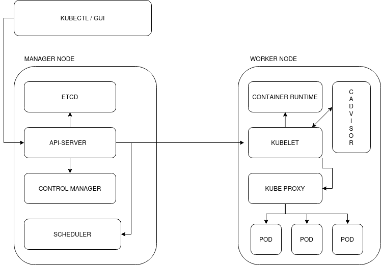

# LEARN K8S DEPLOYING AN APPLICATION WITH MINIKUBE

In this repository, we will try to understand the functioning of Kubernetes using Minikube, a lightweight version of Kubernetes that allows us to run a Kubernetes cluster on a single node containing both the master and manager nodes of the Kubernetes cluster.

Specifically, we will cover the entire process typically followed for developing an application with Kubernetes, starting from the creation of a simple app to the creation of a custom Docker image, and finally deploying it with Minikube.

The journey we will undertake is divided into folders within the repository, as follows:

  - python_project   --> In this directory, we will develop a simple web app with Python using devcontainers.
  - docker_container --> Creating a Docker image for the app, testing, and pushing it to a private registry.
  - minikube         --> Deploying the application with Minikube.

## Kubernetes Architecture

The architecture of Kubernetes is designed to orchestrate and manage containers across a cluster of machines. Here is a detailed analysis of the Kubernetes architecture:

## 1. Kubernetes Cluster

- The Kubernetes cluster is the overall infrastructure composed of a set of nodes running Kubernetes services.
- A Kubernetes cluster consists of at least one master node and one or more worker nodes.

## 2. Master Node

- The master node is responsible for the overall management and control of the cluster.
- Key components on the master node include:
  - **API Server:** Provides a RESTful interface for interacting with the cluster.
  - **Scheduler:** Assigns tasks (pods) to nodes based on available resources and defined constraints.
  - **Controller Manager:** Manages controllers that regulate the desired state of the system.
  - **etcd:** Stores the cluster state in a highly reliable distributed datastore.

## 3. Worker Nodes

- Worker nodes run containers and provide the necessary computational and network resources.
- Key components on each worker node include:
  - **Kubelet:** Acts as an agent on each node, ensuring containers are in a running state.
  - **Kube-proxy:** Manages the cluster network, forwarding network traffic to the correct containers.
  - **Container Runtime:** Software responsible for running containers (e.g., Docker, containerd).

## 4. Pods

- The pod is the smallest deployable unit in Kubernetes.
- A pod can contain one or more containers sharing the same network namespace and storage.
- Containers within a pod can communicate with each other through localhost.

## 5. Controllers

- Controllers in Kubernetes maintain the desired number of replicas of an application running.
- Common types of controllers include ReplicaSet and Deployment.

## 6. Services

- Services provide a persistent way to expose the application, regardless of the number of replicas of the underlying pods.
- Service types include ClusterIP, NodePort, and LoadBalancer.

## 7. ConfigMap and Secrets

- ConfigMap and Secrets are Kubernetes resources used to manage configurations and sensitive data, respectively.

## 8. Namespace

- Namespaces allow the creation of virtual partitions within a Kubernetes cluster.
- They enable the isolation of resources, users, and applications within the same cluster.

## 9. Storage

- Kubernetes supports provisioning and management of storage volumes for containers.
- PersistentVolume (PV) and PersistentVolumeClaim (PVC) are resources used to manage data persistence.

## 10. Addons and Custom Resources

- Kubernetes supports addons like Dashboard, DNS, and ingress controller to extend cluster functionality.
- Custom Resource Definitions (CRD) can be defined to extend the Kubernetes object model.

In general, Kubernetes provides a flexible and modular architecture enabling distributed management of containerized applications, simplifying scalability, resource management, and application deployment in production environments.
